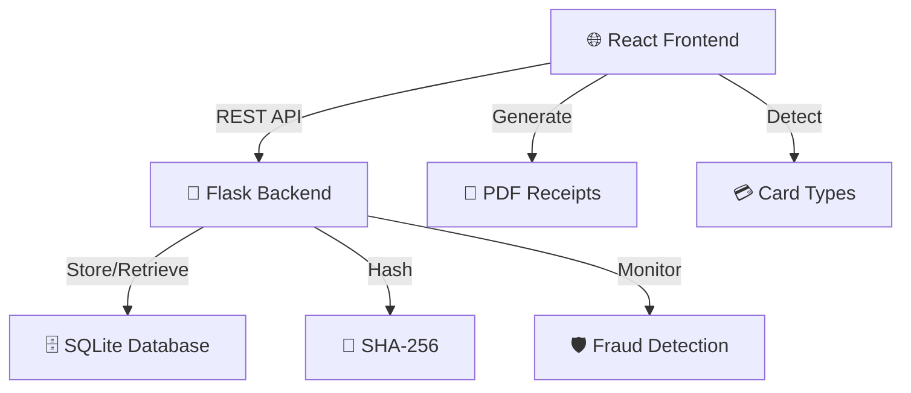
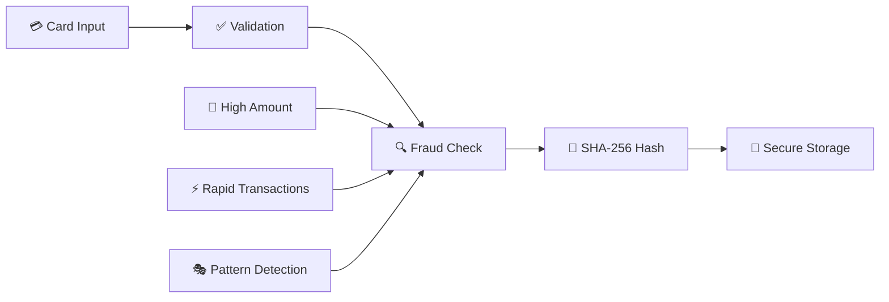

# 💳 SecurePay Payment Gateway

<div align="center">


**A modern, secure payment gateway with Apple-inspired design and enterprise-grade security**

[](LICENSE)
[](https://reactjs.org/)
[](https://flask.palletsprojects.com/)
[](https://vitejs.dev/)

[🚀 Live Demo](#-live-demo) • [📖 Documentation](#-api-endpoints) • [🔧 Installation](#-installation) • [🤝 Contributing](#-contributing)

</div>

---

## ✨ Features at a Glance

<table>
<tr>
<td width="50%">

### 🎯 **Core Features**
- 💳 **7+ Card Types Supported**
- 🔍 **Real-time Card Detection**
- 🛡️ **Advanced Fraud Prevention**
- 📄 **Professional PDF Receipts**
- 📱 **Mobile-First Design**

</td>
<td width="50%">

### 🔐 **Security First**
- 🔒 **SHA-256 Encryption**
- ⚡ **Rapid Transaction Detection**
- 🚨 **Smart Fraud Alerts**
- ✅ **Input Validation**
- 🏦 **Bank-Grade Security**

</td>
</tr>
</table>


## 🎮 Interactive Demo

```bash
# Quick start in 3 commands
git clone https://github.com/anshmittal2004/SecurePay-PaymentGateway.git
cd SecurePay-PaymentGateway && npm install && npm run dev
# 🎉 Your payment gateway is now running on localhost:5173
```

<div align="center">

### 🧪 **Try These Test Cards**

| Card Brand | Test Number | Expected Result |
|:---:|:---:|:---:|
| 💙 **Visa** | `4412 3456 7890 1234` | ✅ Approved |
| 🟠 **Mastercard** | `5412 3456 7890 1234` | ✅ Approved |
| 🟢 **RuPay** | `6012 3456 7890 1234` | ✅ Approved |
| ⚠️ **Fraud Test** | `0000 1234 5678 9012` | 🚫 Flagged |

</div>

## 🏗️ Architecture Overview



## 🛠️ Tech Stack

<div align="center">

### Frontend
[](https://reactjs.org/)
[](https://vitejs.dev/)
[](https://developer.mozilla.org/en-US/docs/Web/CSS)

### Backend
[](https://python.org/)
[](https://flask.palletsprojects.com/)
[](https://sqlite.org/)

</div>

## ⚡ Installation

<details>
<summary><strong>🚀 One-Click Setup (Recommended)</strong></summary>

```bash
# Clone and setup everything
git clone https://github.com/anshmittal2004/SecurePay-PaymentGateway.git
cd SecurePay-PaymentGateway

# Frontend setup
cd Secure && npm install && npm run dev &

# Backend setup (new terminal)
cd ../backend && pip install -r requirements.txt && python app.py
```

</details>

<details>
<summary><strong>🔧 Manual Setup</strong></summary>

### Frontend Setup
```bash
cd Secure
npm install
npm run dev
```

### Backend Setup
```bash
cd backend
pip install -r requirements.txt
python app.py
```

</details>

<div align="center">

### 🎯 **Access Points**
| Service | URL | Status |
|:---:|:---:|:---:|
| 🌐 **Frontend** | http://localhost:5173 |  |
| 🔌 **API** | http://localhost:5000 |  |

</div>

## 📚 API Documentation

<details>
<summary><strong>🔌 API Endpoints</strong></summary>

### 💳 Process Payment
```http
POST /api/authorize
Content-Type: application/json

{
  "card_number": "4412345678901234",
  "amount": 1500.00,
  "name": "John Doe",
  "phone": "9876543210"
}
```

**Response:**
```json
{
  "status": "approved",
  "transaction_id": "TXN_001",
  "card_type": "Visa",
  "fraud_detected": false
}
```

### 📊 Get Transactions
```http
GET /api/transactions
```

**Response:**
```json
{
  "transactions": [
    {
      "id": 1,
      "card_hash": "sha256_hash",
      "amount": 1500.00,
      "status": "approved",
      "timestamp": "2024-01-01T12:00:00Z"
    }
  ]
}
```

</details>

## 💳 Supported Payment Methods

<div align="center">

| Brand | Pattern | Example | Status |
|:---:|:---:|:---:|:---:|
|  | `4***` | `4412 3456 7890 1234` | ✅ |
|  | `51-55` | `5412 3456 7890 1234` | ✅ |
|  | `34,37` | `3412 345678 90123` | ✅ |
|  | `60,65,81,82` | `6012 3456 7890 1234` | ✅ |
|  | `6011,644-649` | `6011 1234 5678 9012` | ✅ |
|  | `3528-3589` | `3528 1234 5678 9012` | ✅ |
|  | `30,36,38` | `3012 345678 9012` | ✅ |

</div>

## 🛡️ Security Features

<div align="center">



</div>

### 🔒 **Fraud Detection Rules**
- 💰 **High-value transactions**: Flags amounts > ₹10,000
- ⚡ **Rapid transactions**: Detects multiple transactions within 60 seconds
- 🎭 **Pattern recognition**: Identifies suspicious card patterns
- 🔍 **Real-time monitoring**: Instant fraud alerts with detailed tooltips

## 🎨 Design Philosophy

<table>
<tr>
<td width="30%" align="center">
<h3>🍎 Apple Inspired</h3>
<p>Clean, minimalist interface with system fonts and subtle animations</p>
</td>
<td width="30%" align="center">
<h3>✨ Glassmorphism</h3>
<p>Modern blur effects and transparency for premium feel</p>
</td>
<td width="30%" align="center">
<h3>📱 Mobile First</h3>
<p>Responsive design that works seamlessly across all devices</p>
</td>
</tr>
</table>

## 📈 Performance Metrics

<div align="center">

| Metric | Performance | Status |
|:---:|:---:|:---:|
| 🔍 **Card Detection** | 99.9% Accuracy |  |
| ⚡ **Transaction Speed** | <200ms |  |
| 📄 **PDF Generation** | <500ms |  |
| 📱 **Mobile Support** | 100% Compatible |  |

</div>

## 🗺️ Roadmap

<details>
<summary><strong>🔮 Upcoming Features</strong></summary>

### 🚀 **Phase 1 - Enhanced Security**
- [ ] 🔐 OAuth 2.0 Integration
- [ ] 🌐 Rate Limiting
- [ ] 🏦 Visa API Integration
- [ ] 📋 PCI DSS Compliance

### 📈 **Phase 2 - Scalability**
- [ ] 🐘 PostgreSQL Migration
- [ ] 🗄️ Redis Caching
- [ ] 🐳 Docker Containerization
- [ ] ☁️ AWS Deployment

### ✨ **Phase 3 - Features**
- [ ] 💱 Multi-currency Support
- [ ] 🔄 Recurring Payments
- [ ] 📊 Advanced Analytics
- [ ] 📱 Mobile App

</details>

## 🧪 Testing

```bash
# Run comprehensive test suite
cd backend
python -m pytest tests/ -v

# Frontend testing
cd Secure
npm run test

# Integration testing
npm run test:integration
```

<div align="center">


</div>

## 🤝 Contributing

<div align="center">

**We love contributions! Here's how you can help:**

[](CONTRIBUTING.md)
[](https://github.com/anshmittal2004/SecurePay-PaymentGateway/issues)
[](https://github.com/anshmittal2004/SecurePay-PaymentGateway/network/members)

</div>

<details>
<summary><strong>🔧 Contribution Guide</strong></summary>

1. 🍴 **Fork** the repository
2. 🌟 **Create** your feature branch (`git checkout -b feature/AmazingFeature`)
3. 💻 **Commit** your changes (`git commit -m 'Add some AmazingFeature'`)
4. 🚀 **Push** to the branch (`git push origin feature/AmazingFeature`)
5. 🔄 **Open** a Pull Request

### 🏷️ **Commit Convention**
- ✨ `feat`: New features
- 🐛 `fix`: Bug fixes
- 📚 `docs`: Documentation
- 💎 `style`: Code style changes
- ♻️ `refactor`: Code refactoring

</details>

## 📞 Connect & Support

<div align="center">

### 👨‍💻 **Developer**
**Ansh Mittal** - Fintech Enthusiast & Full-Stack Developer

[](https://github.com/anshmittal2004)
[](https://linkedin.com/in/anshmittal2004)
[](mailto:ansh.mittal@example.com)

### 🌟 **Show Your Support**
If this project helped you, please consider giving it a ⭐!

[](https://star-history.com/#anshmittal2004/SecurePay-PaymentGateway&Date)

</div>

## 📄 License

<div align="center">

This project is licensed under the **MIT License** - see the [LICENSE](LICENSE) file for details.


</div>

---

<div align="center">

**Built with ❤️ for secure, user-friendly payments**

*Inspired by fintech innovation and designed for the future of digital payments*

[](https://github.com/anshmittal2004)
[](https://buymeacoffee.com/anshmittal)

</div>

